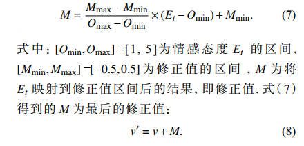

# 采用评论挖掘修正用户评分的改进协同过滤算法

# 1.问题提出

用户的评分数据非常集中且为整数分值，这样的评分数据区分度不明显，可靠性和可信度不高，导致协同过滤推荐效果较差

解决方式：根据评分和评论之间的关联关系，挖掘评论中提及的产品特征和情感描述，建立评论级的特征偏好向量，依据评论的特征偏好向量计算评论的情感态度，再利用情感态度修正相应评分，从而提高评分的区分度和可信度。

# 2.算法

## 1.提取评论中的产品特征词和情感词

1.采用ICTCLAS分词系统对评论进行分词处理

2.采用**改进的词性路径模板提取算法**来提取评论中的产品特征词和情感词

改进的词性路径模板提取算法

1）评论分词，加入词性标注，生成词性句子

2）根据词性路径模板对1中生成的词性句子进行模糊匹配

3）对特征情感词进行过滤

改进在：以前是硬匹配，现在采用“软匹配”，允许有间隔词性的结果句子和模板匹配

## 2.建立用户特征偏好

​	1）将每个用户的所有评论组成该用户的评论文档T

​	2）计算文档中所有特征词的TF-IDF值

​	3）将文档$T_j$中所有特征词的TF-IDF计算结果组成用户的特征偏好，记为

$W=\{TI_{1,j},TI_{2,j}...TI_{i,j}\}$

## 3.建立评论特征偏好向量

对于$T_u$中的任意一条评论t，若t中出现的特征词有w1，w2...,wk，则对应的评论特征偏好向量表示为$S_t=\{q(w_t),q(w_2),...,q(w_k)\}$

.png)

## 4.量化情感词

采用台湾大学NTUSD简体中文情感词典来判断情感词的极性.

对情感词进行量化，量化后的分词组成$R_t=\{r(h_1),r(h_2),...,r(h_K)\}$

## 5.计算评论情感态度

$E_t=S_t·R_t$

## 6.依据情感态度修正评分

浮动因子：符合四舍五入，取0.5

将情感态度转换到目标区间上

## 7.计算综合相似度

1）评分相似度

2）偏好相似度

3）综合相似度

## 8.评分预测和产生推荐

# 3.实验与分析

## 1.数据集

京东的手机评论

## 2.评测标准

准确率、召回率和多样性

多样性有两种：用户间的多样性，用户内的多样性

此处使用用户内的多样性

## 3.1试验结果分析

1.评分修正结果与分析

修正后的小数评分分布范围更广，更加离散化，区分程度明显提高。使修正后的评分更加接近用户评分一元，提高了评分的区分度和可信度

2.推荐结果与分析

证明了算法比 1.协同过滤算法。2.融合用户评论和环境信息的协同过滤推荐算法

​    3.基于用户评论挖掘的产品推荐算法  效果好

